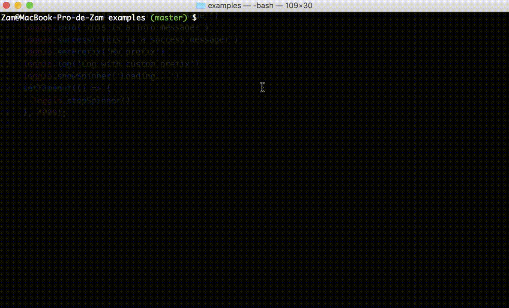

# A super-light logger with colors for NodeJS.



## Features:

* Timestamps
* Context
* Colors
* Easy to use
* Support to print JSON
* Deactivate logs
* Custom prefix
* Show loading spinner

## Log example with loggio:

```
// message ------------------------------------------------------|
// level ---------------------------------------------|          |
// prefix --------|                                   |          |
//                V                                   V          V
Sun Oct 16 2016 16:12:09 GMT+0200 (CEST) | simple-logs.js:4:8 => hello!
```

## Log types:

* Default log (default color): loggio.log('message')
* Error log (red): loggio.error('message')
* Warning log (yellow): loggio.warn('message')
* Info log (blue): loggio.info('message')
* Success log (green): loggio.success('message')

## Set default color:

Set a default color to use in default logs.

```
let loggio = require('loggio')('green')
```

## Deactivate logs:
Second argument indicate if logs are deactivate.
```
let loggio = require('loggio')('white', true)
```

## Set custom prefix:
```
loggio.setPrefix('My prefix')
loggio.log('Log with custom prefix')
// My prefix | simple-logs.js:12:8 => Log with custom prefix
```

## Show loading spinner:
```
loggio.showSpinner('Loading...') // Optional message...
loggio.stopSpinner()
```

## Setup:

```
npm install --save loggio
```

```
//example.js
let loggio = require('loggio')()
loggio.log('hello!') // Sun Oct 16 2016 16:12:09 GMT+0200 (CEST) | simple-logs.js:4:8 => hello!
```
